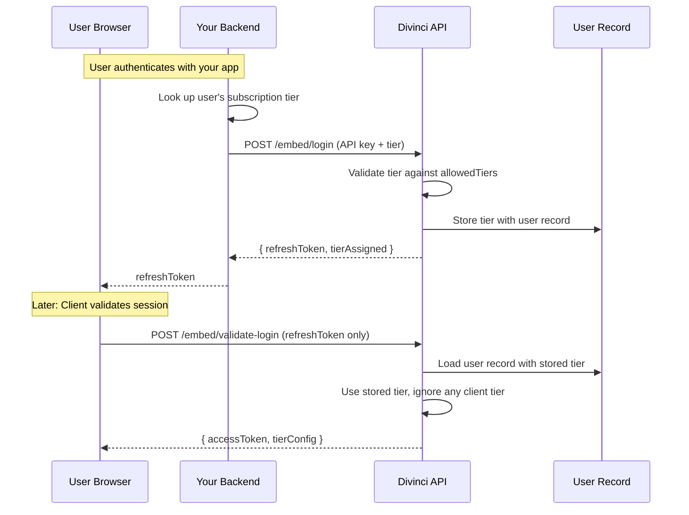
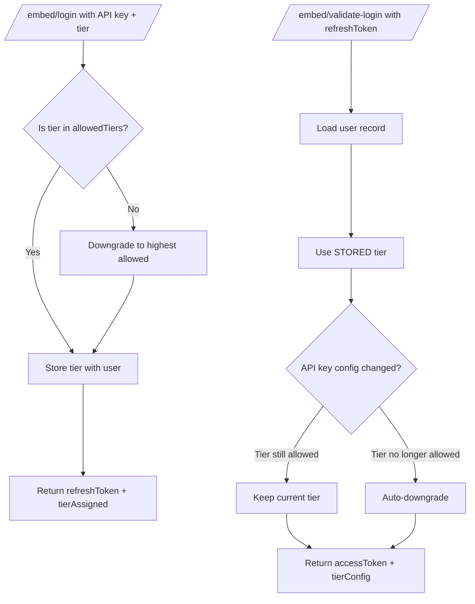

# Membership Tiers for Embed Integration

Control message quotas for your users based on their subscription levels in your application.

## Overview

When integrating the Divinci embed client, you can pass a membership tier during user authentication. This tier determines:

- **Messages per month** - Monthly message quota
- **Messages per day** - Daily message quota
- **Messages per hour** - Hourly burst limit
- **Max conversation length** - Maximum messages per conversation

## Available Tiers

| Tier | Messages/Month | Messages/Day | Messages/Hour | Max Conversation |
|------|----------------|--------------|---------------|------------------|
| `free` | 50 | 10 | 5 | 20 |
| `basic` | 500 | 50 | 20 | 50 |
| `premium` | 5,000 | 200 | 50 | 100 |
| `enterprise` | 50,000 | 2,000 | 200 | 500 |
| `unlimited` | No limit | No limit | No limit | No limit |

---

## Security Model

### Server-Side Tier Enforcement

**The membership tier is set server-side during initial login, not by the browser.**

This is a critical security design: the tier is determined by your backend (which has access to the API key) and stored with the user record. The browser client cannot modify or escalate the tier.

### Two-Step Authentication Flow

1. **Initial Login** (`/embed/login`) - **Server-side, requires API key**
   - Your backend calls this endpoint with the API key and user's subscription tier
   - Tier is validated against `allowedTiers` and stored with the user record
   - Returns a `refreshToken` for the client

2. **Validate Login** (`/embed/validate-login`) - **Client-side, no tier accepted**
   - Browser uses the `refreshToken` to get an `accessToken`
   - Uses the **stored** tier from step 1
   - Tier cannot be changed or escalated by the client



### Why This Design?

**Q: Why not let the browser pass the tier?**

Allowing the browser to specify the tier would be a security vulnerability. A malicious user could:
1. Inspect the JavaScript code
2. Modify the tier parameter to claim "enterprise" or "unlimited"
3. Escalate their privileges

**Q: What prevents privilege escalation now?**

The tier is set **only** during `/embed/login`, which:
1. Requires the secret API key (never exposed to browsers)
2. Validates the tier against `allowedTiers`
3. Stores the validated tier with the user record

The browser-accessible `/embed/validate-login` endpoint:
1. **Ignores** any `membershipTier` parameter in the request
2. Uses **only** the tier stored in the user record
3. Cannot escalate privileges even with a valid `refreshToken`

### Trust Boundaries

| Component | Where It Lives | Security Role |
|-----------|----------------|---------------|
| API Key (`apikey`) | Your backend only | Authenticates the initial login request |
| `membershipTier` | Set in `/embed/login` | Stored server-side, cannot be modified by client |
| `allowedTiers` | API key configuration | Limits which tiers can be assigned |
| `refreshToken` | Browser (via your backend) | Identifies user, does NOT contain tier info |

### Tier Validation Flow



### Automatic Tier Downgrade

If you change your API key's `allowedTiers` configuration, users with now-invalid tiers are automatically downgraded on their next validation:

```
User's stored tier: "enterprise"
API Key allowedTiers (updated): ["free", "basic", "premium"]

Result: User auto-downgraded to "premium" (highest allowed)
```

This ensures your tier configuration always takes precedence.

---

## Admin Configuration (Divinci Dashboard)

White-label release admins can configure membership tiers directly in the Divinci dashboard when creating or editing an API key.

### Accessing Tier Configuration

1. Navigate to your workspace in [Divinci.app](https://divinci.app)
2. Go to **White Label** → **API Keys**
3. Create a new API key or edit an existing one
4. Scroll to **Embed User Membership Tiers**

### Configuring Allowed Tiers

Select which tiers your integration can grant to users:

```
┌─────────────────────────────────────────────────────────┐
│ Embed User Membership Tiers                             │
├─────────────────────────────────────────────────────────┤
│ Allowed Tiers                                           │
│                                                         │
│ ☑ Free        50 msg/month, 10/day, 5/hour             │
│ ☑ Basic       500 msg/month, 50/day, 20/hour           │
│ ☑ Premium     5,000 msg/month, 200/day, 50/hour        │
│ ☐ Enterprise  50,000 msg/month, 2,000/day, 200/hour    │
│ ☐ Unlimited   No limits                                 │
│                                                         │
│ ▸ Advanced: Custom Tier Limits                          │
└─────────────────────────────────────────────────────────┘
```

### Customizing Tier Limits

Click **Advanced: Custom Tier Limits** to override default quotas for any tier:

```
┌─────────────────────────────────────────────────────────┐
│ Customize Premium Tier Limits                           │
├─────────────────────────────────────────────────────────┤
│                                                         │
│ Messages per Month          Messages per Day            │
│ ┌─────────────────────┐     ┌─────────────────────┐    │
│ │ 10000         [Modified]  │ 500                 │    │
│ └─────────────────────┘     └─────────────────────┘    │
│ Default: 5,000              Default: 200                │
│                                                         │
│ Messages per Hour           Max Conversation Length     │
│ ┌─────────────────────┐     ┌─────────────────────┐    │
│ │ 100                 │     │ 150                 │    │
│ └─────────────────────┘     └─────────────────────┘    │
│ Default: 50                 Default: 100                │
│                                                         │
│ [Save Changes]  [Reset to Default]                      │
│                                                         │
│ ℹ Use -1 for unlimited. Changes apply when saved.      │
└─────────────────────────────────────────────────────────┘
```

**Key Points:**
- Only modify the fields you want to customize
- Use `-1` to make any limit unlimited
- Click **Reset to Default** to remove customizations
- Changes take effect when the API key is saved

### Example: SaaS Pricing Model

Map your SaaS subscription plans to Divinci tiers:

| Your Plan | Divinci Tier | Custom Limits |
|-----------|--------------|---------------|
| Starter | `free` | 100 msg/month (doubled) |
| Pro | `basic` | Default limits |
| Business | `premium` | 10,000 msg/month, 500/day |
| Enterprise | `enterprise` | Default limits |

---

## Developer Integration

### 1. Configure Allowed Tiers (API Key Setup)

When creating or updating your API key in the Divinci dashboard, specify which tiers your integration supports:

```json
{
  "name": "My App API Key",
  "allowedOrigins": ["https://myapp.com"],
  "allowedTiers": ["free", "basic", "premium"],
  "customTierLimits": {
    "premium": {
      "messagesPerMonth": 10000
    }
  }
}
```

**Fields:**
- `allowedTiers` - Array of tiers this API key can grant to users
- `customTierLimits` - Optional per-tier limit overrides

### 2. Login with Membership Tier

When authenticating a user, pass their tier in the login request:

#### Server-Side: Get Divinci JWT with Tier

Your backend calls `/embed/login` with the API key and the user's subscription tier:

```typescript
async function getDivinciJWT(userId: string, username: string, tier: string) {
  const response = await fetch("https://api.divinci.ai/embed/login", {
    method: "POST",
    headers: { "Content-Type": "application/json" },
    body: JSON.stringify({
      apikey: "YOUR_API_KEY",  // Secret API key - never expose to browser
      userId: userId,
      username: username,
      membershipTier: tier     // Tier is SET here, server-side only
    })
  });

  const data = await response.json();
  // tierAssigned tells you which tier was actually granted
  // (may be downgraded if requested tier wasn't in allowedTiers)
  console.log(`Tier assigned: ${data.tierAssigned}`);
  return data.refreshToken;
}
```

#### Client-Side: Validate Session

The client uses the `refreshToken` to validate the session. The tier is already stored server-side:

```javascript
const { DivinciChat } = window.DIVINCI_AI;

const chat = new DivinciChat({
  releaseId: "your-release-id",
  externalUser: true,
});

// Login with refreshToken only - tier comes from server
// Note: Any tier parameter passed here is IGNORED for security
const { tierConfig } = await chat.auth.login(userRefreshToken);

// tierConfig contains the stored tier from /embed/login
console.log(`User tier: ${tierConfig.tier}`);
console.log(`Messages remaining: ${tierConfig.remaining.messagesThisMonth}`);
```

**Important:** The `chat.auth.login()` method does NOT accept a tier parameter. Any tier must be set during the server-side `/embed/login` call.

### 3. Tier Validation & Downgrading

If a user requests a tier not in your API key's `allowedTiers`, they are automatically downgraded to the highest allowed tier:

| Requested Tier | Allowed Tiers | Assigned Tier |
|----------------|---------------|---------------|
| `enterprise` | `["free", "basic", "premium"]` | `premium` |
| `premium` | `["free", "basic"]` | `basic` |
| `unlimited` | `["free"]` | `free` |

### 4. Unauthenticated Users

Users who aren't logged into your application cannot use the chat. The embed client handles this automatically.

**Don't call `auth.login()` when there's no token:**

```javascript
const { DivinciChat } = window.DIVINCI_AI;

const chat = new DivinciChat({
  releaseId: "your-release-id",
  externalUser: true,
});

// Append the chat iframe
container.appendChild(chat.iframe);

// Only call auth.login() if you have a token
if (userRefreshToken) {
  chat.auth.login(userRefreshToken);
}
// If no token, the embed automatically shows:
// "Please login through your application"
// "Authentication is managed by your parent application."
```

**Do not pass a blank or empty refreshToken.** Simply skip the `auth.login()` call entirely. The embed will display a login prompt to the user.

---

## Response Format

### Successful Login Response

```json
{
  "valid": true,
  "accessToken": "eyJ...",
  "userInfo": {
    "user_id": "apikey:abc123:user456",
    "nickname": "John Doe",
    "picture": "https://example.com/avatar.jpg"
  },
  "tierConfig": {
    "tier": "premium",
    "limits": {
      "messagesPerMonth": 10000,
      "messagesPerDay": 500,
      "messagesPerHour": 100,
      "maxConversationLength": 150
    },
    "usage": {
      "messagesThisMonth": 150,
      "messagesToday": 12,
      "messagesThisHour": 3,
      "currentConversationLength": 0
    },
    "remaining": {
      "messagesThisMonth": 9850,
      "messagesToday": 488,
      "messagesThisHour": 97
    }
  }
}
```

> **Note:** The `limits` reflect any custom limits configured in the dashboard.

---

## HTTP Response Headers

All message API responses include quota information in headers:

| Header | Description | Example |
|--------|-------------|---------|
| `X-Membership-Tier` | User's current tier | `premium` |
| `X-Quota-Monthly-Used` | Messages used this month | `150` |
| `X-Quota-Monthly-Limit` | Monthly message limit | `10000` |
| `X-Quota-Daily-Used` | Messages used today | `12` |
| `X-Quota-Daily-Limit` | Daily message limit | `500` |
| `Retry-After` | Seconds until quota resets (on 429) | `3600` |

---

## Quota Exceeded (429 Response)

When a user exceeds their quota, the API returns a `429 Too Many Requests` response:

```json
{
  "status": "error",
  "message": "Message quota exceeded",
  "context": {
    "type": "monthly_quota_exceeded",
    "tier": "free",
    "limits": {
      "messagesPerMonth": 100,
      "messagesPerDay": 20,
      "messagesPerHour": 5
    },
    "usage": {
      "messagesThisMonth": 100,
      "messagesToday": 8,
      "messagesThisHour": 3
    },
    "retryAfter": 604800
  }
}
```

**Quota Types:**
- `monthly_quota_exceeded` - Monthly limit reached
- `daily_quota_exceeded` - Daily limit reached
- `hourly_quota_exceeded` - Hourly burst limit reached

---

## Client-Side Quota Warnings

The embed client automatically displays warnings when approaching limits:

| Usage Level | Warning Type | Visual |
|-------------|--------------|--------|
| 80%+ | Warning | Yellow banner |
| 95%+ | Critical | Red banner |
| 100% | Blocked | Error message |

---

## Best Practices

### 1. Map Your Subscription Tiers (Server-Side)

Create a mapping between your subscription plans and Divinci tiers **in your backend**:

```typescript
// In your backend - NOT in browser JavaScript
const TIER_MAPPING: Record<string, string> = {
  "starter": "free",
  "pro": "basic",
  "business": "premium",
  "enterprise": "enterprise"
};

async function getDivinciToken(user: User) {
  const divinciTier = TIER_MAPPING[user.subscriptionPlan] || "free";

  // Call /embed/login from your backend with the API key
  const response = await fetch("https://api.divinci.ai/embed/login", {
    method: "POST",
    headers: { "Content-Type": "application/json" },
    body: JSON.stringify({
      apikey: process.env.DIVINCI_API_KEY,
      userId: user.id,
      username: user.name,
      membershipTier: divinciTier
    })
  });

  return response.json();
}
```

### 2. Handle Quota Exceeded Gracefully

```javascript
try {
  await chat.sendMessage(content);
} catch (error) {
  if (error.status === 429) {
    const { type, retryAfter } = error.context;

    if (type === "monthly_quota_exceeded") {
      showUpgradePrompt("You've reached your monthly limit. Upgrade for more messages.");
    } else if (type === "daily_quota_exceeded") {
      const hours = Math.ceil(retryAfter / 3600);
      showNotification(`Daily limit reached. Try again in ${hours} hours.`);
    }
  }
}
```

### 3. Display Quota Status

```javascript
function displayQuotaStatus(tierConfig) {
  const { remaining, limits, tier } = tierConfig;

  if (tier === "unlimited") {
    return "Unlimited messages";
  }

  const monthlyPercent = (remaining.messagesThisMonth / limits.messagesPerMonth) * 100;
  return `${remaining.messagesThisMonth} of ${limits.messagesPerMonth} messages remaining (${monthlyPercent.toFixed(0)}%)`;
}
```

### 4. Sync Tier on Subscription Changes

When a user upgrades or downgrades their subscription, you need to:
1. Call `/embed/login` from your backend with the new tier
2. Send the new `refreshToken` to the client
3. Have the client re-authenticate

```typescript
// Backend: Re-issue token with new tier
async function onSubscriptionChange(userId: string, newPlan: string) {
  const newTier = TIER_MAPPING[newPlan];

  // Create new token with updated tier
  const response = await fetch("https://api.divinci.ai/embed/login", {
    method: "POST",
    headers: { "Content-Type": "application/json" },
    body: JSON.stringify({
      apikey: process.env.DIVINCI_API_KEY,
      userId: userId,
      username: user.name,
      membershipTier: newTier  // New tier set server-side
    })
  });

  const { refreshToken, tierAssigned } = await response.json();
  return { refreshToken, tierAssigned };
}
```

```javascript
// Client: Re-authenticate with new token from backend
async function handleSubscriptionUpgrade() {
  // Your backend returns new refreshToken with updated tier
  const { refreshToken } = await yourApi.getNewDivinciToken();

  await chat.auth.logout();
  const { tierConfig } = await chat.auth.login(refreshToken);

  console.log(`Upgraded to: ${tierConfig.tier}`);
}
```

---

## Custom Tier Limits

You can override default limits per-tier when configuring your API key:

```json
{
  "customTierLimits": {
    "free": {
      "messagesPerMonth": 100,
      "messagesPerDay": 20
    },
    "premium": {
      "messagesPerMonth": 10000,
      "messagesPerDay": 500,
      "messagesPerHour": 100
    }
  }
}
```

Custom limits are merged with defaults - only specified fields are overridden.

---

## Troubleshooting

### "Tier not allowed" Warning

If you see `Membership tier "X" not allowed, downgrading to "Y"` in logs:
1. Check your API key's allowed tiers in the Divinci dashboard
2. Ensure the tier name is spelled correctly (case-sensitive)

### Custom Limits Not Applied

If custom limits aren't being used:
1. Verify you saved the API key after making changes in the dashboard
2. Check that the tier is in the "Allowed Tiers" list
3. Log out and back in to get a fresh token with updated limits

### Quota Not Updating

If quotas seem stuck:
1. Check Redis connectivity on the server
2. Verify the API key ID and user ID are consistent
3. Check for timezone issues (quotas reset at UTC midnight)

### Missing Tier Config

If `tierConfig` is null after login:
1. Ensure `externalUser: true` in embed config
2. Check the login response for errors
3. Verify the refresh token is valid

---

## Related Documentation

- [How to Embed](./HowToEmbed.md) - Basic embed setup
- [External Login SPA](./external-login-spa/) - React SPA example
- [External Login SSR](./external-login-ssr/) - Server-side rendering example
